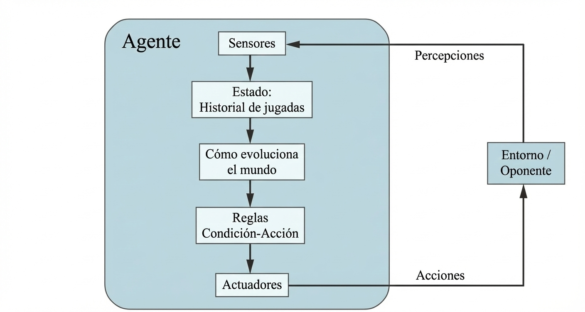

## RPS-LS-MIA-2425
Proyecto de la especialidad **Inteligencia Artifical y Big Data** sobre estructura de un agente en el entorno del juego: **piedra, papel, tijeras (RPS)**.
* [Contorno de tareas](#contorno-de-tareas)
* [Estructura del agente](#estructura-del-agente)
* [Componentes y justificación técnica](#componentes-y-justificación-técnica)
* [Implementación en Python](#implementación-en-python)

## Contorno de tareas
Especificaciones de las características del contorno de las tareas de el **RPS** basado en *"2.3.2 Properties of task environments"* de **Russell & Norvig**

Contorno de tareas | Observable| Agentes | Determinista | Episódico | Estático | Discreto | Conocido
:---: | :---: | :---: | :---: | :---: | :---: | :---: | :---: |
 RPS | Parcialmente Observable | Multi | Estocástico | Secuencial | Estático |  Discreto |  Conocido |

### Justificación
1. Contorno de tareas: **RPS**
2. Observable: **Parcialmente observable**. EL  agente no puede ver que va a sacar si tijeras, piedra o papel (información oculta).
3. Agentes: **Multiagente**. Competitivo, juegas con otro rival, ya sea humano u otro agente.
4. Determinista: **Estocástico**. El resultado que elija va a estar acompañada en el azar, depende del otro jugador.
5. Episódico: **Secuencial**. La decisión que elija afacta a la siguiente ronda(si es mejor a 3, gana).
6. Estático: **Estático**. El juego no cambia hasta que el agente decida en su turno que elegir.
7. Discreto: **Discreto**. Tiene finitos valores a elegir (piedra, papel, tijeras).
8. Conocido: **Conocido**. El agente conoce las reglas del juego antemano.

## Estructura del agente
El agente que elegimos es **Agente reactivo basado en modelos**. Tenemos que ver las tendecias del rival. Agente de reactivo simple valdría, pero sería insuficiente.
 
 
Estructura modelo:
 
 

## Componentes y justificación técnica 
Para que la función agente mapee las percepciones en acciones de manera eficiente, se han implementado los siguientes componentes internos:

* **Sensores (Captura de Percepciones):** Mecanismo encargado de recibir la última acción del oponente (input del usuario) y transformarla en un dato procesable para el modelo.
* **Estado Interno (Modelo del Mundo):** Estructura de datos persistente que mantiene el historial de interacciones. Este componente permite al agente "recordar" el pasado, mitigando la falta de observabilidad directa sobre la estrategia futura del rival.
* **Evolución del Mundo (Lógica Predictiva):** Proceso que analiza el estado interno para actualizar el modelo de conducta del oponente. En nuestro caso, evalúa las probabilidades de transición (qué suele jugar el humano tras una acción específica) para estimar el movimiento más probable.
* **Reglas de Condición-Acción (Mapeo de Decisión):** Una vez obtenida la predicción del modelo, el agente aplica una regla lógica de selección de respuesta: *"Si la predicción es X, ejecutar la acción Y que maximiza la utilidad (victoria)"*.
* **Actuadores (Ejecución):** Componente que materializa la decisión del agente, devolviendo el resultado a la consola y afectando el estado del entorno de juego.

## Implementación en Python
La solución se ha construido bajo un enfoque modular y desacoplado, lo que permite que el motor del juego y la inteligencia del agente funcionen de forma independiente. Se han priorizado los siguientes pilares de desarrollo:

* **Separación de responsabilidades (SRP)**: Cada parte del código tiene una misión única. Las reglas (quién gana a quién) están aisladas de la lógica de decisión (qué debe jugar el agente), evitando que el programa se convierta en una red compleja de condiciones difíciles de mantener.

* **Diseño extensible (OCP)**: El sistema es totalmente flexible. Gracias a esta estructura, introducir nuevos gestos como Lagarto o Spock es tan sencillo como actualizar la tabla de victorias, sin necesidad de reprogramar el "cerebro" del agente.

### Estrategia del Agente: Anticipación y Respuesta
Para que el agente no juegue a ciegas, se ha dotado a la función  `get_computer_action()` de una capacidad de análisis basada en la experiencia previa
